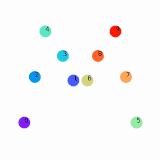
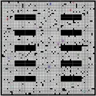
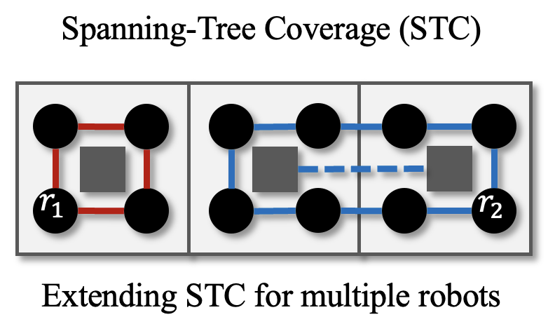
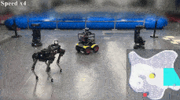

## About Me
I am Jingtao Tang, currently a 3rd year Ph.D. student in the <a href="https://www2.cs.sfu.ca/~hangma">AIRob</a> lab supervised by Professor Hang Ma at Simon Fraser University.
My current research focuses on various planning problems for (multi-) robot systems.
Before that, I worked at the Shenzhen Institute of Artificial Intelligence and Robotics for Society (AIRS), and studied and worked in the Intelligent Motion Planning and Vision Laboratory at East China Normal University (ECNU).
I am strongly motivated to empower multiple robots with versatile skills to address practical applications in our daily lives.

## Research
<table style="width:100%;border:0px;border-spacing:0px 10px;border-collapse:separate;margin-right:auto;margin-left:auto;">
<tbody>
    <tr>
      <td style="padding:6px;width:35%;vertical-align:middle">
        

          
        

      </td>
      <td style="padding:6px;width:65%;vertical-align:middle;font-size: 12.5px;">
        &#128204;&nbsp;
        Space-Time Graphs of Convex Sets for Multi-Robot Motion Planning
        |
        &#127760;&nbsp;
        <a href="https://sites.google.com/view/stgcs">Homepage</a>
        |
        &nbsp;<a href="https://arxiv.org/abs/2503.00583">ArXiv</a>
        |
        <i style="font-size:16px" class="fa">&#xf09b;</i>&nbsp;<a href="https://github.com/reso1/stgcs">Code</a>
        

		&#128101;&nbsp;
        <strong>Jingtao Tang</strong>, 
        Zining Mao, 
        Lufan Yang, 
        <a href="https://www.cs.sfu.ca/~hangma/">Hang Ma</a>
        

        &#128226;&nbsp;
        <a href="https://www.iros25.org/"><em>IROS</em>-25</a>
        |
        <a href="https://mrs-workshop.github.io/rss25/"><em>RSS</em>-25 Workshop on MRS</a> (<strong>Best Paper Award</strong>)
        

        
&#128161;&nbsp;<em>TL;DR</em>: A time-optimal deterministic spatiotemporal planner for multi-robot motion planning.

      </td>
    </tr>
    <tr>
      <td style="padding:6px;width:35%;vertical-align:middle">
        

          
        

      </td>
      <td style="padding:6px;width:65%;vertical-align:middle;font-size: 12.5px;">
        &#128204;&nbsp;
        Large-Scale Multirobot Coverage Path Planning on Grids with Path Deconfliction
        |
        &#127760;&nbsp;
        <a href="https://sites.google.com/view/lsmcpp">Homepage</a>
        |
        &nbsp;<a href="https://arxiv.org/abs/2411.01707">ArXiv</a>
        |
        <i style="font-size:16px" class="fa">&#xf09b;</i>&nbsp;<a href="https://github.com/reso1/ls-mcpp">Code</a>
        

		&#128101;&nbsp;
        <strong>Jingtao Tang</strong>, 
        Zining Mao, 
        <a href="https://www.cs.sfu.ca/~hangma/">Hang Ma</a>
        

        &#128226;&nbsp;
        <a href="https://aaai.org/conference/aaai/aaai-24/"><em>AAAI</em>-24</a>
        |
        IEEE Transactions on Robotics (T-RO), vol. 41, pp. 3348-3367, 2025
        

        
&#128161;&nbsp;<em>TL;DR</em>: An algorithmic pipeline to plan conflict-free coverage paths for multiple robots on grids.

      </td>
    </tr>
    <tr>
      <td style="padding:6px;width:35%;vertical-align:middle">
        

          
        

      </td>
      <td style="padding:6px;width:65%;vertical-align:middle;font-size: 12.5px;">
        &#128204;&nbsp;
        Multi-Robot Connected Fermat Spiral Coverage
        |
        &nbsp;<a href="https://arxiv.org/abs/2403.13311">ArXiv</a>
        |
        <i style="font-size:16px" class="fa">&#xf09b;</i>&nbsp;<a href="https://github.com/reso1/mcfs">Code</a>
        

		&#128101;&nbsp;
        <strong>Jingtao Tang</strong>,
        <a href="https://www.cs.sfu.ca/~hangma/">Hang Ma</a>
        

        &#128226;&nbsp;
        <a href="https://icaps24.icaps-conference.org/"><em>ICAPS</em>-24</a>
        

        
&#128161;&nbsp;<em>TL;DR</em>: A decomposition-free multi-robot coverage path planning algorithm that generates smooth and continuous trajecories for arbitrarily-shaped workspaces.

      </td>
    </tr>
    <tr>
      <td style="padding:6px;width:35%;vertical-align:middle">
        

          
          
        

      </td>
      <td style="padding:6px;width:65%;vertical-align:middle;font-size: 12.5px;">
        &#128204;&nbsp;
        Mixed Integer Programming for Time-Optimal Multi-Robot Coverage Path Planning With Efficient Heuristics
        |
        &#127760;&nbsp;
        <a href="./posts/grid_mcpp">Homepage</a>
        |
        &nbsp;<a href="https://arxiv.org/abs/2306.17609">ArXiv</a>
        |
        <i style="font-size:16px" class="fa">&#xf09b;</i>&nbsp;<a href="https://github.com/reso1/MIP-MCPP">Code</a>
        

		&#128101;&nbsp;
        <strong>Jingtao Tang</strong>,
        <a href="https://www.cs.sfu.ca/~hangma/">Hang Ma</a>
        

        &#128226;&nbsp;
        IEEE Robotics and Automation Letters (RA-L) 8.10 (2023): 6491-6498.
        

        
&#128161;&nbsp;<em>TL;DR</em>: A mixed-integer program for min-max tree cover problem and grid-based multi-robot coverage path planning.

      </td>
    </tr>
    <tr>
      <td style="padding:6px;width:35%;vertical-align:middle">
        

          
        

      </td>
      <td style="padding:6px;width:65%;vertical-align:middle;font-size: 12.5px;">
        &#128204;&nbsp;
        Learning to Coordinate for a Worker-Station Multi-robot System in Planar Coverage Tasks
        |
        &#127760;&nbsp;
        <a href="./posts/worker_station_mcpp">Homepage</a>
        |
        &nbsp;<a href="https://arxiv.org/abs/2208.02993">ArXiv</a>
        

		&#128101;&nbsp;
        <strong>Jingtao Tang</strong>,
        <a href="https://gaoyuankidult.github.io/">Yuan Gao</a>,
        <a href="https://freeformrobotics.org/tllam/">Tin Lun Lam</a>
        

        &#128226;&nbsp;
        IEEE Robotics and Automation Letters (RA-L) 7.4 (2022): 12315-12322.
        

        
&#128161;&nbsp;<em>TL;DR</em>: A DRL-based decentralized planning for collaborative coverage task of a heteogeneous multi-robot system.

      </td>
    </tr>
    <tr>
      <td style="padding:6px;width:35%;vertical-align:middle">
        

          
        

      </td>
      <td style="padding:6px;width:65%;vertical-align:middle;font-size: 12.5px;">
        &#128204;&nbsp;
        MSTC*: Multi-robot Coverage Path Planning under Physical Constrain
        |
        &#127760;&nbsp;
        <a href="./posts/mcpp_mp_rough_terrain">Homepage</a>
        |
        &nbsp;<a href="https://arxiv.org/abs/2108.04632">ArXiv</a>|
        <i style="font-size:16px" class="fa">&#xf09b;</i>&nbsp;<a href="https://github.com/reso1/mstc_star">Code</a>
        

		&#128101;&nbsp;
        <strong>Jingtao Tang</strong>,
        Chun Sun,
        <a href="https://faculty.ecnu.edu.cn/_s43/zxy2/main.psp">Xinyu Zhang</a>
        

        &#128226;&nbsp;
        <a href="https://www.ieee-ras.org/about-ras/ras-calendar/event/1920-icra-2021">ICRA-21</a>
        

        
&#128161;&nbsp;<em>TL;DR</em>: planning problems from an ambitious project: robot swarms for large-scale ecological restoration task.

      </td>
    </tr>
    <tr>
      <td style="padding:6px;width:35%;vertical-align:middle">
        

          
        

      </td>
      <td style="padding:6px;width:65%;vertical-align:middle;font-size: 12.5px;">
        &#128204;&nbsp;
        Hybrid Projection for Encoding 360 VR Videos
        |
        &#127760;&nbsp;
        <a href="./posts/360_vr_projection">Homepage</a>
        |
        &nbsp;<a href="https://ieeexplore.ieee.org/document/8798261">Paper</a>
        

		&#128101;&nbsp;
        <strong>Jingtao Tang</strong>,
        <a href="https://faculty.ecnu.edu.cn/_s43/zxy2/main.psp">Xinyu Zhang</a>
        

        &#128226;&nbsp;
        <a href="https://ieeevr.org/2019/">IEEE-VR-19</a>
        

        
&#128161;&nbsp;<em>TL;DR</em>: A hybrid projection format for efficient encoding/decoding panarama VR videos. 

      </td>
    </tr>
</tbody>
</table>

