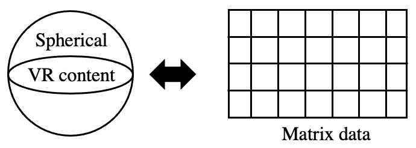
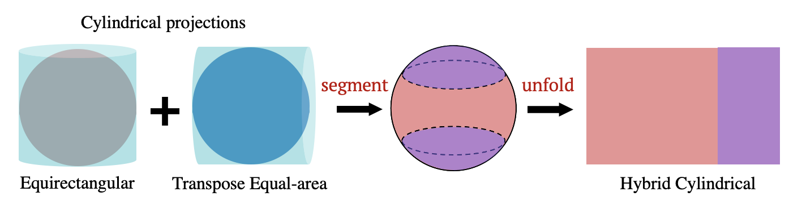
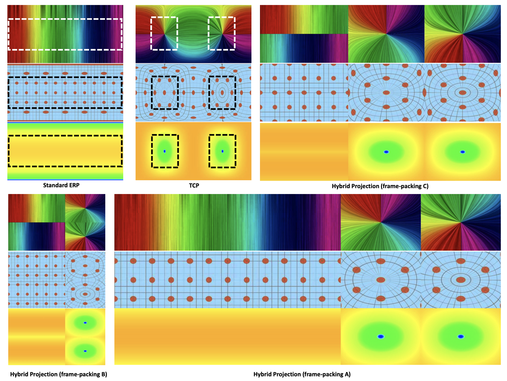
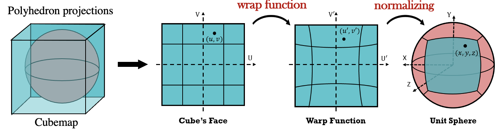
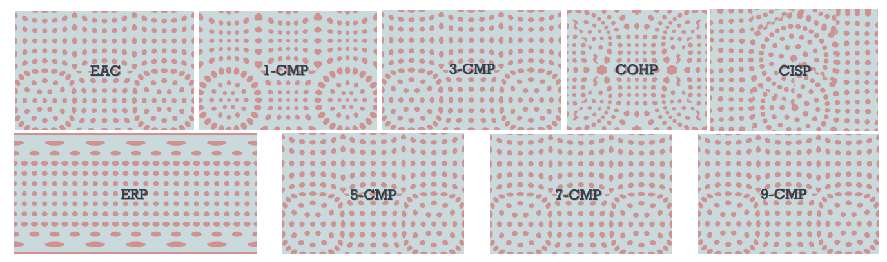

# Projection Formats for Encoding 360 VR Video

#### In this project, we aim to improve the user experience of remote telepresense for human operators in a Multi-robot System (MRS), e.g., the ecological restoration MRS. We designed efficient projections for spherical VR content obtained from 360 degree spherical cameras mounted on robots. 

*Figure: Converting the 360 VR spherical content to conventional matrix data.*

#### The major challenge is to design continuous and distortion-less projection to convert from sphere to rectangular plane by surface parameterization, as shown in the above figure. Based on the equirectangular projections, we proposed a hybrid projection format to fuse two types of projections with compact frame packing schemes. 

*Figure: Combining the projection formats of ERP and Transpose-EAP.*

We desgined three compact frame packing schemes for the hybrid projection. The demonstration of stretching and discontinuity (QoE) of the formats are shown in the figure below. This [paper](https://ieeexplore.ieee.org/abstract/document/8798261/) leads to a conference publication at IEEE-VR 2019, and the basic idea is described in the below figure.

*Figure: QoE of Projections, (a)(b) are two basic cylindrical projections ERP and TCP. (c)(d)(e) are three frame-packing layouts under hybrid projections. The top, middle and bottom graphs from (a) to (e) is to demonstrate discontinuity, distortion and pixel density.*

#### Based on the polyhedron projections, we designed a generalized cubemap projection via numerical approximation to minimize the area stretching ratio.

*Figure: Generalized polynomial approximation based on Cubemap projeciton.*

#### In order to characterize local distortions caused by projection, we use Tissot’s indicatrix to visualize the magnitude of distortion at given sample points as shown in the figure below. This [work](https://onlinelibrary.wiley.com/doi/abs/10.1111/cgf.13843) lead to a journal publication at Pacific Graphics / Computer Graphics Forum 2019, and the basic idea is described in the below figure.

*Figure: The Tissot’s indicatrix map, the higher order CMP, the less projection distortion.*
