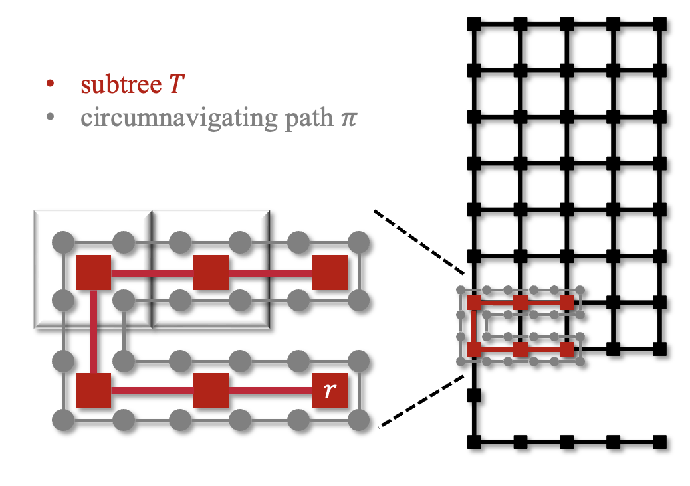
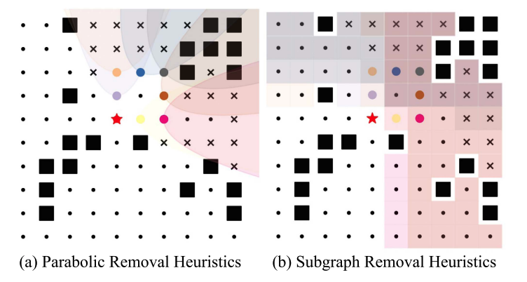
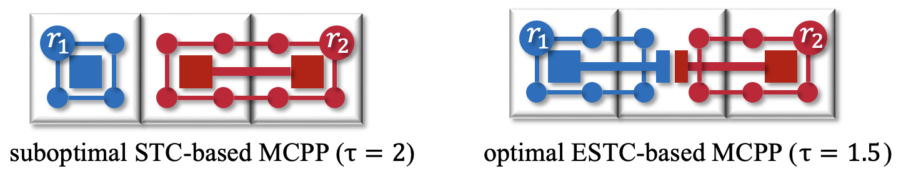
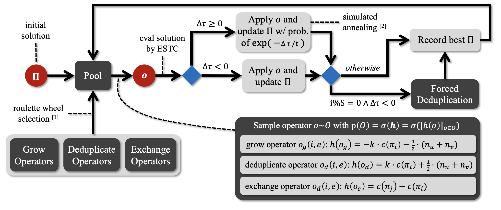

# Grid(Graph)-based Methods for Multi-Robot Coverage Path Planning

#### This project focuses on systematical research for the grid-based Multi-Robot Coverage Path Planning (MCPP) problem, which is an underexplored planning problem for the multi-robot systems. Grid-based methods abstract workspaces into square grids, allowing for the application of various graph algorithms. Following the previous Multirobot Forest Coverage ([MFC](https://ieeexplore.ieee.org/stamp/stamp.jsp?arnumber=5629446)) work, we leverage the Spanning Tree Coverage ([STC](https://link.springer.com/content/pdf/10.1023/A:1016610507833.pdf)) that constructs a minimum spanning tree and then generates circumnavigating coverage paths on the tree. With STC, the MCPP problem reduces to the Min-Max Rooted Tree Cover (MMRTC) problem, that finds a set of covering subtrees of a graph with minimzed makespan. The above reduction from MCPP to MMRTC has an optimality ratio of 4. MFC extends a suboptimal algorithm to solve MMRTC with an optimality ratio of 4, yielding its MCPP solution an optimality ratio of 16 in total. 

*Figure: A illustration of the circumnavigating coverage path of STC. With a set covering of covering subtrees of the graph, we can cover all the small grey circles.*

#### To improve from MFC, we first build a mixed integer programming model that optimally solves MMRTC and thus resulting MCPP solutions with an optimality ratio of 4. We borrowed the constraints from the classic Stenier tree problem to ensure that each subtree retains a tree structure without any cycle. We proved the correctness of our model for MMRTC.

*Figure: Proposed two suboptimal heuristics on a graph, where the black squares are obstacles, and black dots and crosses are vertices of the graph. For the subtree rooted at the red star, the black crosses indicates the vertices that should not be covered by the subtre and thus being removed from the model, and the black dots are the vertices remained on the model.*

#### To make the model more scalable to larger-sized instances, we design effective model reduction heuristics to effectively reduces the model variables while preserving the optimality as much as possible. The key for our heuristics design is based on the obersvation that each rooted subtree would only cover the nearby regions around its root but not those regions near other roots. Check our [RA-L paper](https://www2.cs.sfu.ca/~hangma/pub/ral23c.pdf) for more details.

<iframe src="https://player.vimeo.com/video/918506751?badge=0&amp;autopause=0&amp;player_id=0&amp;app_id=58479" frameborder="0" allow="autoplay; fullscreen; picture-in-picture; clipboard-write" style="position:absolute;top:0;left:0;width:100%;height:100%;" title="MIP-MCPP simulation"></iframe>

#### Although we managed to reduce the optimality ratio from 16 to 4 in the work above, its scalability to larger-scaled instances is not enough, requireing several hours for only 4 robots and a 32x32 grid map with about 800 vertices 1400 edges. 

*Figure: Illustrations of STC-based MCPP and ESTC-based MCPP.*

As our final coverage is on the small circles instead of the larger sqaures, so why don't just operate on the graph of these small circles. This idea not only provides us an enlarged solution space, but also a way to addressing MCPP when there are some small circles blocked and thus untraversable, which is unallowed for STC and MFC. To this end, we design ESTC upon STC to compute coverage path on any connected graph of the small circle vertices.

*Figure: The proposed LS-MCPP framework for MCPP.*

#### We then designed a local search framework to effectively and efficiently explore the MCPP solution space. It consists of the following key components:
1. Boundary editing operators: three types of operators that effectively transits a given set of subgraphs into another set of subgraphs.
2. The iterative and adpative sampling and search schemes on the solution neighborhood, consisting of the roulette wheel selection and simulated annealing.
3. The ESTC subroutine: its time effiency enables fast computation and evaluatation of a MCPP solution for a set of subgraphs of the small vertices, each assigned to one robot.

Empirically, the above proposed LS-MCPP framework performs and scales well to very-large scale instances  (32 robots and 128x128 grid maps with 11k vertices and 21k edges). Check our [AAAI'24 paper](https://arxiv.org/pdf/2312.10797.pdf) for more details.

<iframe src="https://player.vimeo.com/video/894744842?badge=0&amp;autopause=0&amp;player_id=0&amp;app_id=58479" frameborder="0" allow="autoplay; fullscreen; picture-in-picture; clipboard-write" style="position:absolute;top:0;left:0;width:100%;height:100%;" title="LS-MCPP simulation"></iframe>

