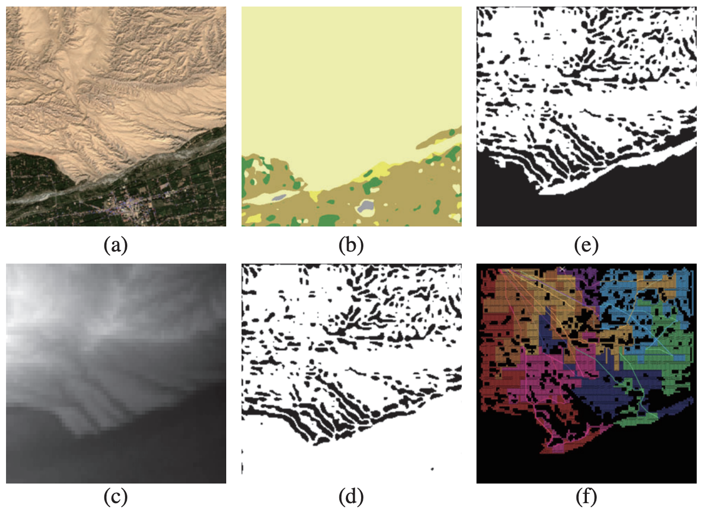
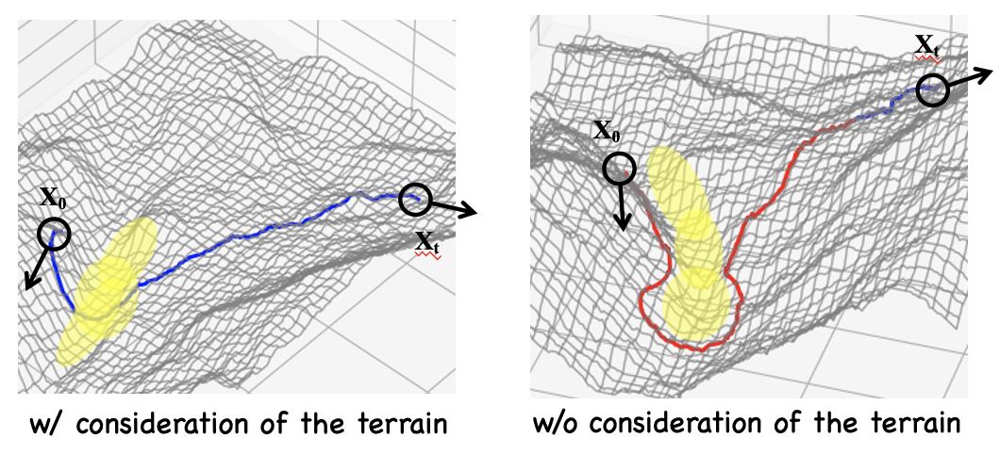

# Multi-robot Coverage Path Planning & Motion Planning on Complex Terrain

#### In this project, After which, we abstracted the ecologic restoration task as Multi-robot Coverage Path Planning (mCPP) problem under several practical considerations. These considerations can be summarized as the following physical constraints: 1) terrain traversability of mobile robots in the fields; 2) limited capabilities such as energy and consumables; 3) fault-tolerance towards uncertainties and malfunctions.

<iframe src="https://player.vimeo.com/video/535512748?h=fa4ec2047c&badge=0&autopause=0&player_id=0&app_id=58479/embed" allow="autoplay; fullscreen; picture-in-picture" allowfullscreen frameborder="0" style="position:absolute;top:0;left:0;width:100%;height:100%;"></iframe>

#### Therefore, we first designed a learning-based algorithm to generate the terrain traversability map, and then proposed a graph-based planning algorithm that greedily finds sub-optimal balanced cutoff points to make coverage planning for each robot. My contributions were co-implementing the traversability map generating algorithm, and designing and implementing of the whole planning algorithm. The [work](https://arxiv.org/abs/2108.04632) lead to a conference publication at ICRA 2021.

*Figure: Traversability analysis of a field terrain around (78.48◦E,
37.22◦N).(a) Satellite map image. (b) Land cover predict. (c) DEM representing the height information. (d) DEM filtering reulst. (e) The fusion result
of land cover predict and DEM filtering. (f) The coverage path planning on
the terrain.*

#### Also, since fault tolerance is very important for multi-robot systems especially for those operated in remote environments, we consider cases where robots can malfunction based on the preivous MSTC* work. This extension [work](https://ieeexplore.ieee.org/abstract/document/9517650/) lead to another conference publication at RCAR 2021.

*Figure: Motion planning results with and without considering the terrain traversability.*

#### Also, generating feasible trajectories on rough terrain is a challenge for MRS working on desertified lands. In addition to the mCPP problem, when waypoints are provided by the mCPP planner. I also designed a dynamic-window approach to evaluate trajectory maneuvers in the hybrid A* algorithm. The proposed motion planning algorithm can avoid infeasible trajectories under rough terrain during the heuristic search process.

<iframe src="https://player.vimeo.com/video/758274947?h=c48b4cd35b&amp;badge=0&amp;autopause=0&amp;player_id=0&amp;app_id=58479" frameborder="0" allow="autoplay; fullscreen; picture-in-picture" allowfullscreen style="position:absolute;top:0;left:0;width:100%;height:100%;" title="motion planning w/ terrain traversability"></iframe>

