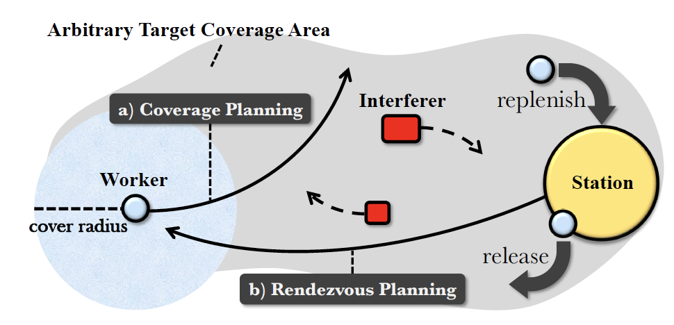
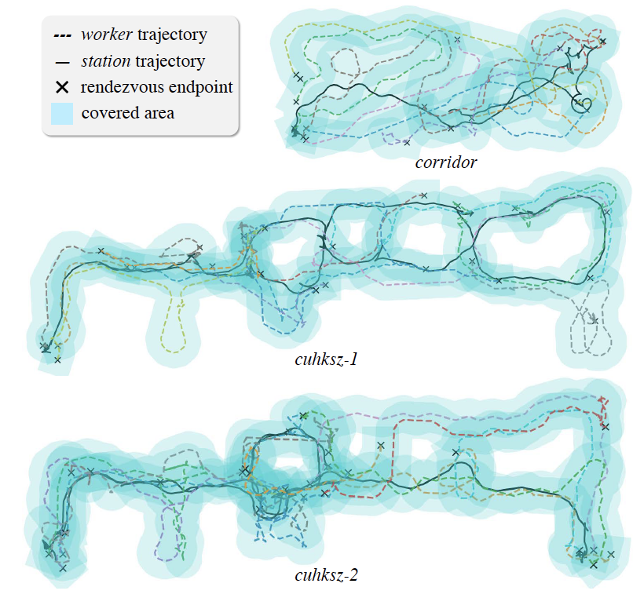
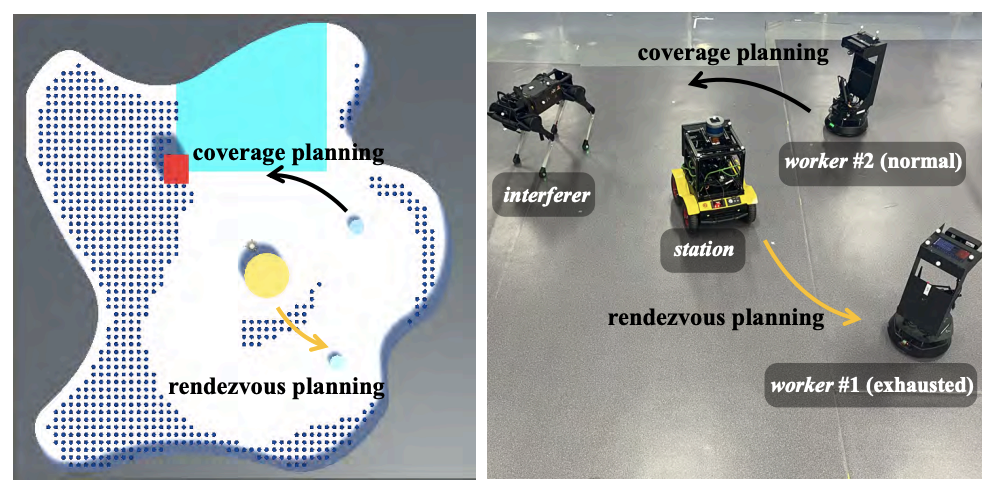

# Decision Making & Planning for Heterogeneous Multi-robot System

#### In this project, we focus on decision making and planning problems for heterogeneous multi-robot system. In the ecological restoration project, we use MSTC* where the coverage working robots need to constantly travel between the working spots and a static base station to replenish resources. 

*Figure: Given an arbitrary target coverage area, a mCPP problem for the worker-station MRS on planar areas can be decomposed into: 1) coverage planning for workers (blue robots) and 2) rendezvous planning for station (yellow robot). There are random dynamic interferers (red robots) in the environment.*

#### As a continuation, we mobilized the base station as a robot to replenish the working robots in need, and then adopted multi-agent reinforcement learning methods to solve the mCPP problem for the so-called worker-station MRS. 

<iframe src="https://player.vimeo.com/video/758241347?h=a430f55276&amp;badge=0&amp;autopause=0&amp;player_id=0&amp;app_id=58479" frameborder="0" allow="autoplay; fullscreen; picture-in-picture" allowfullscreen style="position:absolute;top:0;left:0;width:100%;height:100%;" title="learning to coordinate for a worker-station multi-robot system in planar coverage tasks"></iframe>

#### We formulate a fully cooperative MARL problem with Dec-POMDP for the system. We then design a two-stage curriculum learning with the intrinsic curiosity module, which successfully guided the training and further improved the planning efficiency. Our method manages to reduce the influence of random dynamic interferers on planning, while the robots can avoid collisions with them.

*Figure: Motion trajectories of worker-station MRS using our method.*

#### We validate our method in both simulation and real world robot platform. The [work](https://arxiv.org/abs/2208.02993) is accepted for publication (to appear) by IEEE Robotics and Automation Letters.

*Figure: Real robot setup of the worker-station multi-robot system.*
